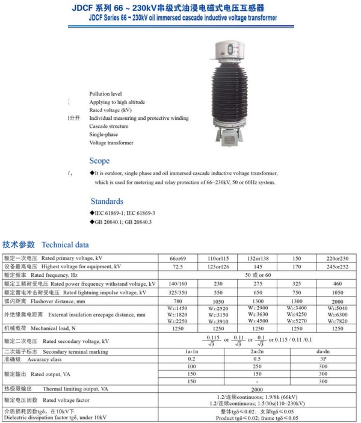

# Transformer Instrumentation Project

## Overview

This project details the instrumentation of a three-phase 10MVA 66kV/13.8kV power transformer, focusing on monitoring its input and output voltage, current, operating frequency, and power. Instrument transformers (potential and current transformers) are used to scale down high voltage and current levels for safe monitoring and control. This project was completed as part of the IECE 513 Energy Systems course at the University at Albany.

## Key Features

* **Instrumentation of a 10MVA Transformer:** Comprehensive design for monitoring key parameters of a 66kV/13.8kV, Delta-Star, 60Hz power transformer.
* **Selection and Analysis of Instrument Transformers:** Selection of appropriate ratings for CTs and PTs to scale down voltage and current.
* **Passive Component Specification:** Calculation of burden resistor values for interfacing with monitoring circuitry.
* **Analog/Digital Circuitry Design:** Block diagram level description of circuitry for voltage, current, frequency, and power measurement.
* **Component Identification:** Part number identification from component manufacturers for selected instrument transformer ratings.

## Design Components

* **Current Transformers (CTs):**
    * Primary Side: 100/5A, Part Number: 2DARL-101 (GE Grid)
       

    * Secondary Side: 500/5A, Part Number: Model 500 (GE)
      

    * **Operation:** The primary winding is connected in series with the current to be measured. The secondary winding, with more turns, is rated for 1A or 5A. The turns ratio determines the current reduction.
       

    * **Construction:** Types include wound, bar, and window. The CT secondary should never be left open.
      

* **Potential Transformers (PTs):**
    * Primary Side: 66kV/115V, Part Number: JDCF-72.5W3 (JDCF)
      

    * Secondary Side: 13.8kV/110V, Part Number: PTG5-1-110 (GE)
      

    * **Operation:** PTs step down high voltage, maintaining a fixed proportion.
      

    * **Construction:** Larger cores and conductors than power transformers. Shell-type for low voltage, core-type for high voltage.
      

* **Passive Components:**
    * Burden Resistors: Calculated values for CT and PT outputs.
        * CTs: 3-ohm burden resistor for both primary and secondary.
            

        * PTs: Primary PT: 73.52 ohms, Secondary PT: 11.50 ohms.
          

* **Monitoring Circuitry:**
    * Analog: Rectifiers, filters, amplifiers.
    * Digital: ADCs, microcontrollers, communication interfaces.
    * **Measurement Techniques:**
        * **Current:**
        * 

        * **Voltage:**
           

        * **Power:** CT, PT -> Rectifiers, Op-Amps -> ADC -> Microcontroller (calculates P=VI*pf) -> Display
                     

        * **Frequency:** Measured by the microcontroller based on the ADC's digital output.
                     

## Instrumentation Details

* **Transformer Specifications:**
    * 10MVA, 66kV/13.8kV, Delta-Star, 60Hz.
     

* **Monitoring Parameters:**
    * Input and output voltages.
    * Input and output currents.
    * Operating frequency.
    * Input and output power.
* **Scaling:**
    * Using CT's and PT's to bring high voltage and current into a 15V range for monitoring.

## Simulation and Results

* **Circuit Design:** Implementation of circuitry to process instrument transformer outputs.
* **Data Acquisition:** Digital processing and transmission of measured data to a monitoring computer.
* **Parameter Calculation:** Calculation of power and frequency from measured voltage and current.

## Usage

1.  **Component Selection:** Refer to the provided part numbers for CTs and PTs.
2.  **Circuit Implementation:** Design and build the analog and digital monitoring circuitry based on the block diagrams.
3.  **Data Monitoring:** Connect the circuitry to a monitoring computer to observe and record the transformer's parameters.

## Project Structure

* **documentaiton/**: Contains documentation, Includes calculation sheets for component selections and specification.
* **images/**: Contains images used in the documentation.

## Acknowledgments

This project was completed as part of the IECE 513 Energy Systems course at the University at Albany.

## Contact

For any questions or further information, please contact akhilreddy1607@gmail.com.
